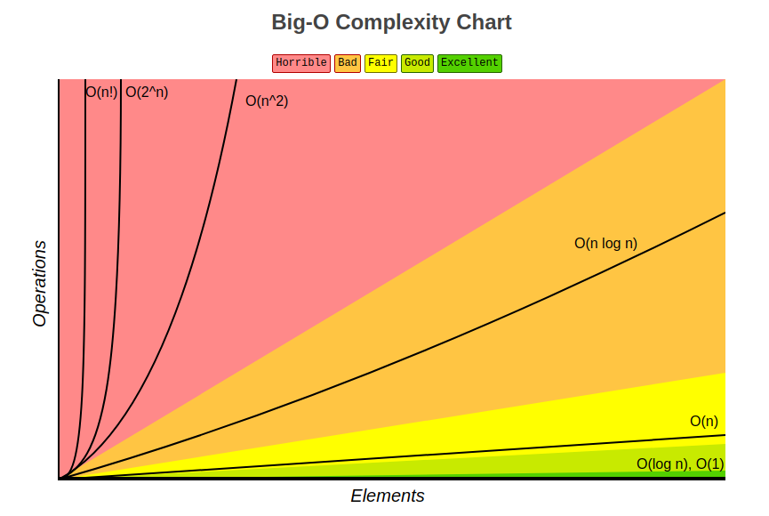
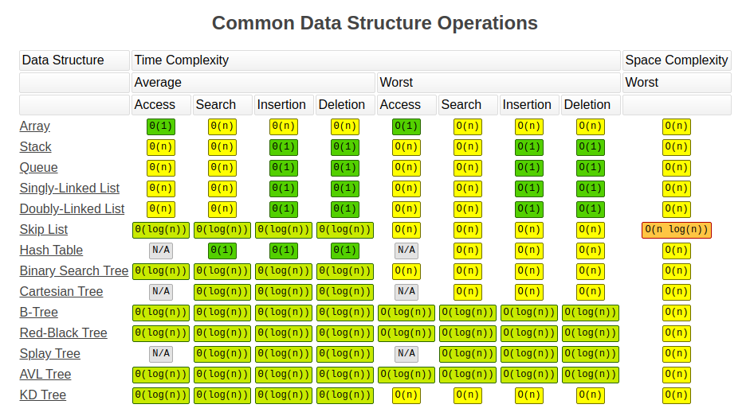
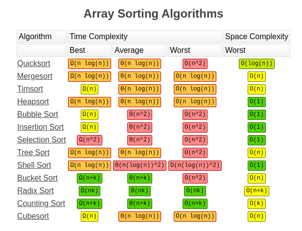

# JavaScript Algorithms and Data Structures

## Структуры данных

## Алгоритмы

* **Сортировка**
  * [Сортировка пузырьком](src/algorithms/sorting/bubble-sort)
  * [Сортировка выбором](src/algorithms/sorting/selection-sort)

### Big O Notation

*Нотация О большое* - это математическая нотация, которая описывает ограничивающее поведение функции, когда аргумент стремится к определенному значению или бесконечности. Он является членом семейства нотаций, изобретенных Полом Бахманом, Эдмундом Ландау и другими, которые в совокупности называются нотациями Бахмана-Ландау или асимптотическими нотациями. Проще говоря, нотация О большое описывает сложность вашего кода с использованием алгебраических терминов :)

Ниже приведен список наиболее часто используемых нотаций Big O и их сравнение производительности с различными размерами входных данных.

| Большая О | 10 элементов | 100 элементов | 1000 элементов  |
| -------------- | ---------------------------- | ----------------------------- | ------------------------------- |
| **O(1)**       | 1                            | 1                             | 1                               |
| **O(log N)**   | 3                            | 6                             | 9                               |
| **O(N)**       | 10                           | 100                           | 1000                            |
| **O(N log N)** | 30                           | 600                           | 9000                            |
| **O(N^2)**     | 100                          | 10000                         | 1000000                         |
| **O(2^N)**     | 1024                         | 1.26e+29                      | 1.07e+301                       |
| **O(N!)**      | 3628800                      | 9.3e+157                      | 4.02e+2567                      |

### Сложность операций со структурами данных

### Сложность алгоритмов сортировки

